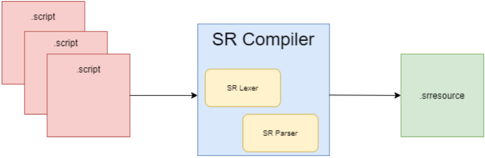

# C++ to resource file compiler

**SR Compiler is a compiler that converts components and variables defined in C++ files into a format recognized by the game engine. Uses C++ macros to make it work**

## How it Works
This project is part of the [Squirrel Engine](https://github.com/Squirrel-Engine). The SR Compiler needs some macros that you add in the C++ file. It creates resource file by using these macros by scanning them in code. Squirrel Engine does not actively use this compiler. We plan to add it in future versions. It's fundamentally uses four macros.



```cpp
SR_ACTOR()      // Put at the beginning of the actors
SR_COMPONENT()  // Put at the beginning of the components
SR_VAR_START()  // Put at the beginning of the variables
SR_COMP_START() // Put at the beginning of the components in actor
```

These macros should be placed at the beginning or inside of actors and components.

```cpp
SR_COMPONENT()
class  RenderComponent : Squirrel::ActorComponent
{
public:
	RenderComponent();
	void  getMesh();
	
	SR_VAR_START()
	int meshID;
	char  meshChar;
	double  dob;
	int  testVar;
	SR_VAR_END()
	
	Mesh ammo;
	Texture we;
};
SR_COMPONENT()
```
The resource file produced by the compiler shows the components and variables defined in the C++ class

```cpp
<Component RenderComponent >
	<var>
		int meshID
		char meshChar
		double dob
		int testVar
	</var>
</Component>
```
